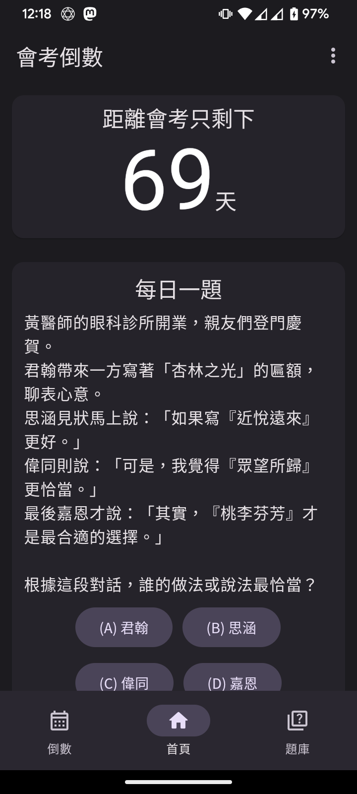

# 會考沙漏 — CAP Countdown


## 📖 簡介

具有試題等豐富功能的會考沙漏計時器  
支援的平台包含 Linux、Android、iOS、macOS、Windows 還有 Web！  
此外，手機版如果覺得看題目的圖片太小，可以直接用手去縮放，像是 IG 一樣。

## 🖼️ 展示



## ⚙️ 開發

請先安裝 [Flutter SDK](https://docs.flutter.dev/get-started/install)。

### CLI

```shell
flutter pub get
dart run build_runner build
flutter run
```

### Technologies

- [Flutter](https://flutter.dev)
- [Dart](https://dart.dev)

## 🎓 授權與版權資訊

- 本應用程式的程式碼皆採用 [GNU General Public License v3.0 (GPL-3.0)](https://www.gnu.org/licenses/gpl-3.0.html)
  授權條款釋出，詳情請參閱 [LICENSE](LICENSE) 檔案。
- 本應用程式內的國中教育會考歷屆試題（含聽力音檔）皆來自於 [國中教育會考全國試務會](https://cap.rcpet.edu.tw/NEAC/About/About)
與 [國立臺灣師範大學心理與教育測驗研究發展中心](https://rcpet.edu.tw/)，且本應用程式與上述兩個單位無任何關係。
- 本應用程式內的國中教育會考歷屆試題的詳解皆來自於 [甄戰一點通](https://www.reallygood.com.tw/newExam/inside?str=F7229F6ADD9F230A5FB41A782B73F2A0)
，且本應用程式與上述單位無任何關係。
- [點我看](readme/image_material.md)圖片素材引用資訊